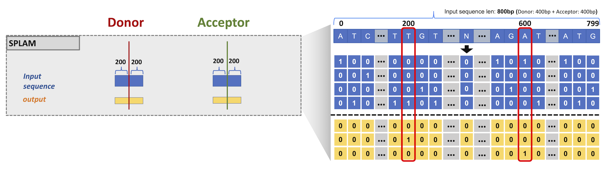

.. _behind-the-scenes-splam:

behind the scenes of splam
=================================================

Data curation
+++++++++++++++++++++++++++++++++++

Data plays a critically important role in deep learning. The model performance largely depends on the quality, quantity, and relevenace of the data used for training. 

To understand how splam works, you first need to understand the how we generate data to train splam. For curating input splice sites, our approach differs from the state of the art tool, spliceAI, which is trained on splice sites labeled on canonical transcripts. Our approach focuses on a smaller region that encompasses the donor and acceptor sites. 

Our approach involves extracting a 400bp sequence centered around the splice sites, shifting the focus from learning the splicing pattern at the transcript level to the splice site level. This strategy enables localized prediction of splicing events, mitigating biases associated with canonical transcripts and eliminating the need for larger window sizes encompassing the entire intron and 10,000 flanking sequences. In summary, each data point in our SPLAM model consists of a donor-acceptor pair with a 400bp window size for each, resulting in a total of 800bps.

Data encoding
---------------

The input to the model is 800bp one-hot encoded DNA sequences in the dimension of :code:`4 x 800`, and the output is the probability of every base pair if it is a donor site, acceptor site, or neither in the dimension of :code:`3 x 800`. Three scores sum up to 1. For the development of splam, we use Pytorch version 1.13.0 framework.

Positive data
---------------

we filtered the junctions by extracting only those that were supported by more than 100 alignments in the Tiebrush merged BAM file. Furthermore, we used RefSeq GRCh38 patch 14 annotation to extract all protein coding genes and intersected all 100-alignments-supported splice sites with the protein coding splice sites observed in the RefSeq database.

The resulting splice sites were then categorized as “Positive MANE” if they were in the Ensembl GRCh38 MANE release 1.0 file, and “Positive ALT” if they were only in RefSeq GRCh38 patch 14 but not in MANE.

This approach provides expression evidence to supports splice junctions, and thus eliminates transcription noise and increasing our confidence in the extracted donor and acceptor sites.
Overall, we identified 180,195 splice sites in Positive MANE and 85,908 splice sites in Positive ALT

Negative data
---------------

Curating high-quality negative splice junctions is a challenging task due to incomplete annotation, unknown function, and potential transcriptional noise. Labeling unannotated junctions as negatives without caution may misclassify some spliced junctions. Various methods can be used to generate negative splice junctions, such as selecting random dinucleotide pairs or random GT-AG pairs from the genome. However, these artificial junctions may differ significantly from true splice sites, leading to the learning of non-critical patterns by the model and resulting in low sensitivity and precision.

To address this issue in training SPLAM, two novel approaches were adopted for generating challenging negative splice junctions. The first approach involved selecting random GT-AG pairs on the opposite strand of protein-coding gene loci. Since overlapping genes are rare in eukaryotes, it is unlikely to have another transcribed gene on the opposite strand of a protein-coding gene. This resulted in 4,467,910 splice junctions referred to as "Negative Random."

To further increase the difficulty of negative junctions, only splice junctions with 1-alignment support on the opposite strand of protein-coding gene loci were chosen. These junctions are likely to be transcription noise or alignment artifacts and should be eliminated, making them more suitable for SPLAM training. This approach generated 2,486,305 splice junctions referred to as "Negative 1." Accurately curating these challenging negative splice junctions is crucial for effective training of SPLAM.

Model input & output dimension
--------------------------

.. figure::  ../image/splam_data_curation.png
    :align:   center
    :scale:   21 %

|

Model architecture
+++++++++++++++++++++++++++++++++++

splam utilized a deep residual convolutional neural network (CNN) that incorporates grouped convolution layers within the residual units. 

Residual unit
---------------

splam architecture consists of 20 residual units, each containing two convolutional layers. The model uses a grouped convolution approach with a parameter called :code:`group` set to 4. The hyperparameters of splam include :code:`F` (number of filters), :code:`W` (window size), :code:`D` (dilation rate), and :code:`G` (groups), which are shown as (:code:`F`, :code:`W`, :code:`D`, :code:`G`) in :ref:`Figure a <spalm_model>`. The concept of grouped convolution, which allows for memory savings with minimal accuracy loss, is inspired by the ResNext model.

.. For a convolutional layer, nucleotide in the sequence, it checks the region of :code:`F x (W-1)`, and therefore :code:`2F x (W-1)` neighboring positions for a residual unit. Furthermore, in a grouped convolution with :code:`G` groups, :code:`F/G` filters are applied to each :code:`F/G` of the input for a $G$× reduction in parameters used. In total, there are 651,715 parameters in splam. 

Each convolutional layer in the residual unit follows a batch normalization and a rectified linear unit (ReLU) :ref:`Figure b<spalm_model>`, and the input of the unit is residually connected to its output. Residual units were first proposed by He et al. in 2015 \citep{he2016deep} to solve the training accuracy degradation problem. The residual mapping (shortcut connections) successfully makes the deeper model be trainable by simple stochastic gradient descent (SGD) with backpropagation, and enjoys the accuracy gains from the increment of the depth.

Residual group
---------------

A group of four residual units forms a bigger residual group, and 20 RU are clustered into five residual groups. Residual groups are stacked such that the output of the i \ :sup:`th`\  residual group is connected to the i+1 \ :sup:`th`\  residual group. Furthermore, the output of each residual group undergoes a convolutional layer, with the parameters :code:`(64, 1, 1)`, and then being added to all the other outputs of residual groups (residual connections colored in red), which then is passed into the last convolutional layer in :code:`(3, 1, 1)` and a softmax layer.  $F$ is set to $64$ for all convolutional layers, and for each residual group, $W$ is set to $11$, $11$, $11$, $21$, and $21$, and $D$ is set to $1$, $5$, $10$, $15$, and $20$ in residual groups in sequence. $G$ is by default is $1$ for all convolutional layers, but setting to $4$ in the residual units. We visualized the architecture of splam in Figure \ref{fig:figure_7}. For each nucleotide position, its total neighboring span of splam model is $S=\sum_{i=1}^{20}2F_{i}\times(W_{i}-1)$. Theoretically, this model architecture can any take various sequence mode running in sequence-to-sequence mode same as SpliceAI \citep{oord2016wavenet, jaganathan2019predicting}; however, since we only train splam in splice site level with 800bp concatenated donor-acceptor pairs as inputs, we always pad the output of each convolution layer to maintain 800bps. 

.. _spalm_model:
.. figure::  ../image/splam_model_architecture.png
    :align:   center
    :scale:   18 %

|

splam training & testing
+++++++++++++++++++++++++++++++++++

Learning rate
---------------

.. figure::  ../image/train_lr.png
    :align:   center
    :scale:   80 %

Training precision
--------------------

.. figure::  ../image/train_J_threshold_precision.png
    :align:   center
    :scale:   80 %

Testing precision
--------------------
.. figure::  ../image/test_J_threshold_precision.png
    :align:   center
    :scale:   80 %

|
|
