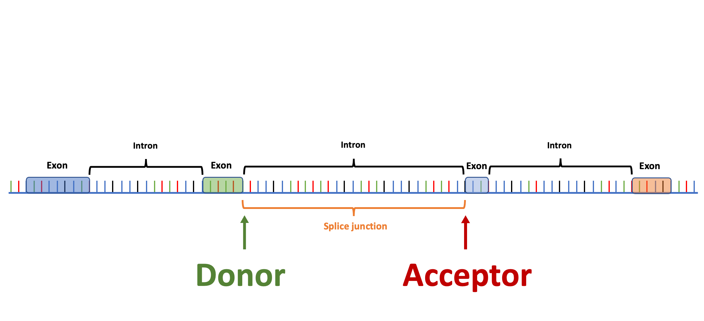

.. raw:: html

    
    <link rel="preload" href="./_images/jhu-logo-dark.png" as="image">

    
|

.. _main:

Splam's tutorial
*************************

.. _splam-logo:
.. figure::  ./_static/logo.png
   :align:   center
   :scale:   13 %

|

.. image:: https://img.shields.io/badge/License-MIT-yellow.svg
    :target: https://img.shields.io/badge/License-MIT-yellow.svg

.. image:: https://img.shields.io/badge/version-v.1.0.10-blue
    :target: https://img.shields.io/badge/version-v.1.0.10-blue

.. image:: https://img.shields.io/github/downloads/Kuanhao-Chao/splam/total.svg?style=social&logo=github&label=Download
    :target: https://img.shields.io/github/downloads/Kuanhao-Chao/splam/total.svg?style=social&logo=github&label=Download

.. image:: https://img.shields.io/badge/platform-macOS_/Linux-green.svg
    :target: https://img.shields.io/badge/platform-macOS_/Linux-green.svg

.. image:: https://colab.research.google.com/assets/colab-badge.svg
    :target: https://colab.research.google.com/github/Kuanhao-Chao/splam/blob/main/notebook/splam_example.ipynb

| 

.. What is Splam?
.. ==================

Splam is a splice site predictor utilizing a deep residual convolutional neural network for **fast and accurate** evaluation of splice junctions solely based on 400nt DNA sequences around donor and acceptor sites.

|

Why Splam❓
==================

1. **We need a tool to evaluate splice junctions & spliced alignments.** Thousands of RNA-Seq datasets are generated every day, but there are no tools available for cleaning up spurious spliced alignments in these data. Splam addresses this problem!
2. **Splam-cleaned alignments lead to improved transcript assembly, which, in turn, may enhance all downstream RNA-Seq analyses**, including transcript quantification, differential gene expression analysis, and more!

|

Who is it for❓
====================================

If you are **(1) doing RNA-Seq data analysis** or **(2) seeking a trustworthy tool to evaluate splice junctions (introns)**, then Splam is the tool that you are looking for!

|

What does Splam do❓
====================================

There are two main use case scenarios:

1. Improving your **alignment file**. Splam evaluates the quality of spliced alignments and removes those containing spurious splice junctions. This significantly enhances the quality of downstream transcriptomes [:ref:`Link <alignment-detailed-section>`].

2. Evaluating the quality of introns in your **annotation file or assembled transcripts** [:ref:`Link <annotation-detailed-section>`].

Splam is free, it's open source, it's a lightweight deep learning model, and it's in Python!

.. It was trained on donor and acceptor pairs combined and focuses on a narrow window of 400 basepairs surrounding each splice site, inspired by the understanding that the splicing process primarily depends on signals within this specific region.

|

Main features
=============

* **Biologically inspired training process**: Splam was trained on combined donor and acceptor pairs, emulating the behavior of the spliceosome, with a specific emphasis on a narrow window of 400 base pairs surrounding each splice site. This approach is inspired by the understanding that the splicing process predominantly relies on signals within this specific region.
* **Generalization to non-human species**: Splam was trained exclusively using human splice junctions; however, we have demonstrated that it performs well on chimpanzee, mouse, and even the flowering plant *Arabidopsis thaliana*.
* **Python & C++ integration**: We have taken care of all the engineering work for you! Splam is easy to install and runs efficiently due to its underlying C++ implementation. You can install and run Splam with just one simple command.
* **Run Splam in three steps**: With just three lines of code, you can obtain a new alignment file that is cleaned and sorted.
* **Pytorch implementation**: Splam is implemented and trained using the popular and reliable PyTorch framework.

|

What Splam doesn't do
==================================

Splam does not have the feature to scan through the genome and score every potential splice site. Some splice site prediction tools take a DNA sequence and predict the splice sites within it, such as `SpliceAI <https://github.com/Illumina/SpliceAI>`_. However, SpliceAI was only trained on a single canonical transcript for each protein-coding gene while disregarding alternative isoforms. Splam takes a different approach, focusing on predicting at the "splice junction level" rather than the "transcript level." Splam was trained on a large collection of human splices sites taken from both "canonical" and alternative isoforms.

|

Cite us
==================================

.. raw:: html
    
    
Kuan-Hao Chao, Jakob M. Heinz, Celine Hoh, Alan Mao, Alaina Shumate, Mihaela Pertea, and Steven L. Salzberg. <i>"Splam: a deep-learning-based splice site predictor that improves spliced alignments."</i> <b>Genome Biology</b> 25, 243 (2024).
    <a href="https://doi.org/10.1186/s13059-024-03379-4" target="_blank"> <svg xmlns="http://www.w3.org/2000/svg" aria-hidden="true" x="0px" y="0px" viewBox="0 0 100 100" width="15" height="15" class="icon outbound"><path fill="currentColor" d="M18.8,85.1h56l0,0c2.2,0,4-1.8,4-4v-32h-8v28h-48v-48h28v-8h-32l0,0c-2.2,0-4,1.8-4,4v56C14.8,83.3,16.6,85.1,18.8,85.1z"></path> <polygon fill="currentColor" points="45.7,48.7 51.3,54.3 77.2,28.5 77.2,37.2 85.2,37.2 85.2,14.9 62.8,14.9 62.8,22.9 71.5,22.9"></polygon></svg> </a> 

|

User support
============
Please go through the :ref:`documentation <table-of-contents>` below first. You can find common questions and answers in the :ref:`FAQ <Q&A>` section. If you have questions about using the package, a bug report, or a feature request, please use the GitHub issue tracker here:

https://github.com/Kuanhao-Chao/splam/issues

|

Key contributors
================

Splam deep residual convolutional neural network was trained using the PyTorch framework by Kuan-Hao Chao. Kuan-Hao Chao also implemented the package that applies Splam to evaluate annotation files and clean up alignment files. Alan Mao benchmarked Splam on non-human species. This documentation was written by Kuan-Hao Chao and Alan Mao.

|

.. _table-of-contents:

Table of contents
==================

.. toctree::
   :maxdepth: 2

   content/installation
   content/quickstart
   content/alignment_evaluation
   content/annotation_evaluation
   content/generalization
   content/behind_scenes
   content/how_to_page
   content/function_manual
   content/license
   content/contact

|
|
|
|
|

.. image:: ./_images/jhu-logo-dark.png
   :alt: My Logo
   :class: logo, header-image only-light
   :align: center

.. image:: ./_images/jhu-logo-white.png
   :alt: My Logo
   :class: logo, header-image only-dark
   :align: center